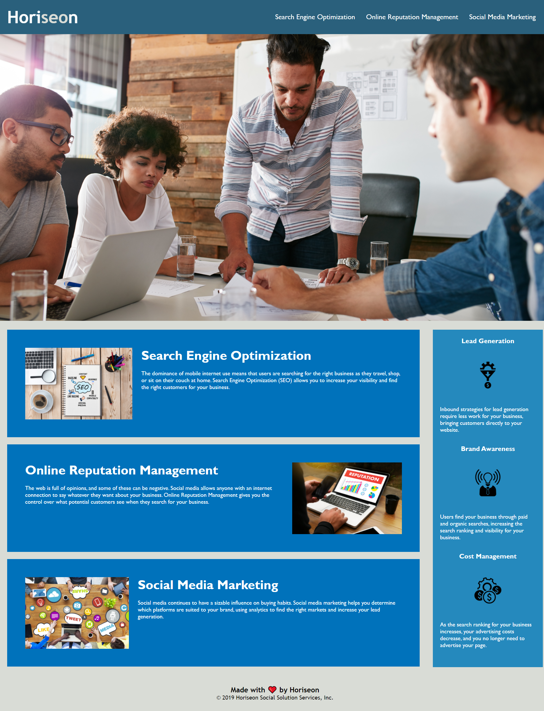

# homework-week-1

## Horiseon Code Refactor

In this project a marketing agency asked for their website's code to be refactored in such a way that it follows accessibility standards so that it is optimized for search engines.

A variety of changes can be seen throughout the comments in index.html and style.css. Semantics and organization now follow best practices, and various CSS styles were consolidated for clarity and readability. Addiotnally, a bug was fixed in which the Search Engine Optimization link in the navigation bar did not function correctly.

## Screenshot of Final Product

## Link to Deployed Application

https://jtboyman.github.io/homework-week-1/